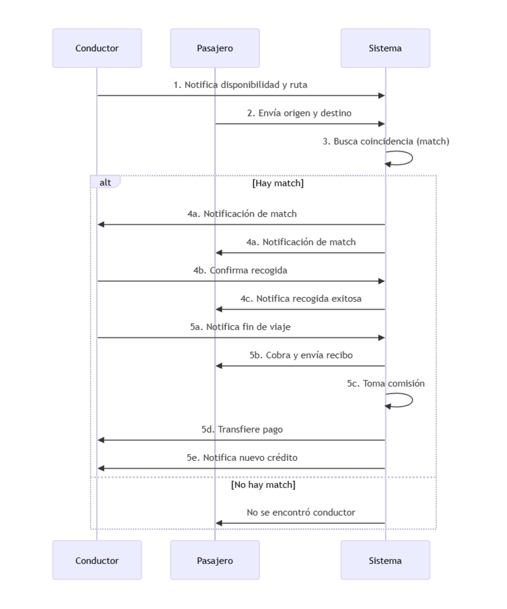

# 🧩 Feature Requirements – Step by Step Process

En esta lección, continuamos con el análisis de los **requisitos funcionales** del sistema, y presentamos un enfoque **formal, estructurado y visual** para capturarlos: un proceso de tres pasos basado en **casos de uso**, **flujos de usuario** y **diagramas de secuencia**.

---

## 📌 Motivación

En la lección anterior se destacó la importancia de recolectar todos los requisitos del sistema antes de diseñar la arquitectura. Sin embargo, esto implica enfrentar:

- Ambigüedad en los requerimientos.
- Gran alcance funcional.
- Multiplicidad de actores y escenarios.

Una forma ingenua de abordar esto sería pedir al cliente que enumere todo lo que el sistema debe hacer. Pero esta estrategia es **incompleta y arriesgada**, especialmente en sistemas complejos.

Por ello, se propone un enfoque más estructurado usando:

- **Casos de uso** (*use cases*)
- **Flujos de usuario** (*user flows*)
- **Diagramas de secuencia**

---

## 🪜 Proceso de 3 pasos para capturar los requisitos funcionales

### Paso 1️⃣: Identificar a todos los actores del sistema

Un **actor** es cualquier usuario o sistema externo que interactúa con nuestro sistema. Sin una identificación completa de los actores, **omitiremos casos de uso importantes**.

### Paso 2️⃣: Definir todos los casos de uso

Un **caso de uso** es un escenario específico en el que un actor utiliza el sistema para alcanzar un objetivo.

**Ejemplos (servicio de ride-sharing):**

- Registro de un nuevo pasajero.
- Registro de un nuevo conductor.
- Inicio de sesión por parte del usuario.
- Inicio de sesión por parte del conductor.
- Coincidencia exitosa entre conductor y pasajero.
- Intento fallido de emparejamiento.

Estos casos de uso cubren tanto escenarios positivos como negativos.

### Paso 3️⃣: Expandir cada caso de uso como un flujo de usuario

Cada caso se detalla como un **flujo de eventos** entre el actor y el sistema, representando:

- Las **acciones** del usuario o sistema.
- La **data** que fluye en cada interacción.

---

## 📈 Visualización: Diagramas de secuencia

Una forma efectiva de representar estos flujos es mediante **diagramas de secuencia**, parte del lenguaje UML (Unified Modeling Language).

### 🧭 ¿Qué es un diagrama de secuencia?

- Representa **interacciones entre entidades** (usuarios, sistemas, servicios).
- El **tiempo fluye de arriba hacia abajo**.
- Cada entidad es una **línea vertical**.
- Las **comunicaciones** se representan con flechas entre entidades.
- Las **respuestas** son líneas discontinuas en sentido contrario.

Aunque UML no se usa estrictamente en la industria, los **diagramas de secuencia sí son comunes** para representar interacciones clave.

---

## 📌 Ejemplo: Coincidencia exitosa entre conductor y pasajero

### Actores:

- Conductor (ya autenticado)
- Pasajero (ya autenticado)
- Sistema

### Flujo:

1. El conductor notifica que está disponible y su ruta.
2. El pasajero envía su origen y destino.
3. El sistema intenta emparejar al pasajero con un conductor.
4. Si hay match:
   - Ambos son notificados.
   - El conductor se dirige al punto de recogida.
   - El pasajero es notificado cuando la recogida se ha realizado.
5. Al finalizar el viaje:
   - El conductor notifica al sistema.
   - El sistema cobra al pasajero y envía el recibo.
   - El sistema toma su comisión y transfiere el resto al conductor.
   - El conductor es notificado del nuevo crédito.

> Este flujo será representado en un diagrama de secuencia (en una herramienta visual externa).

---

## 🚀 Beneficios de este enfoque

- **Identificación temprana de futuras APIs**:
  Cada interacción puede convertirse en una llamada a una API del sistema.
- **Claridad entre equipos**:
  Facilita la comunicación entre diseño, desarrollo y QA.
- **Base para pruebas funcionales**:
  Cada caso de uso puede transformarse en un escenario de prueba.

---

## ✅ Conclusión

Este enfoque formal en 3 pasos permite capturar todos los **requisitos funcionales** de manera:

1. **Completa** (actores bien definidos).
2. **Estructurada** (casos de uso claros).
3. **Visual** (diagramas de secuencia comprensibles).

Este proceso **reduce la ambigüedad**, garantiza cobertura funcional y sirve como base sólida para diseñar APIs y arquitecturas escalables.

---

[Anterior](https://github.com/wilfredoha/Software_Architecture_and_Design_of_Modern_Large_Scale_Systems/blob/main/01_System_Requirements_%26_Architectural_Drivers/01_Introduction_to_System_Design_%26_Architectural_Drivers.md)   [Siguiente](https://github.com/wilfredoha/Software_Architecture_and_Design_of_Modern_Large_Scale_Systems/blob/main/01_System_Requirements_%26_Architectural_Drivers/03_System_Quality_Attributes_Requirements.md)

[Menú Principal](https://github.com/wilfredoha/Software_Architecture_and_Design_of_Modern_Large_Scale_Systems/tree/main)
